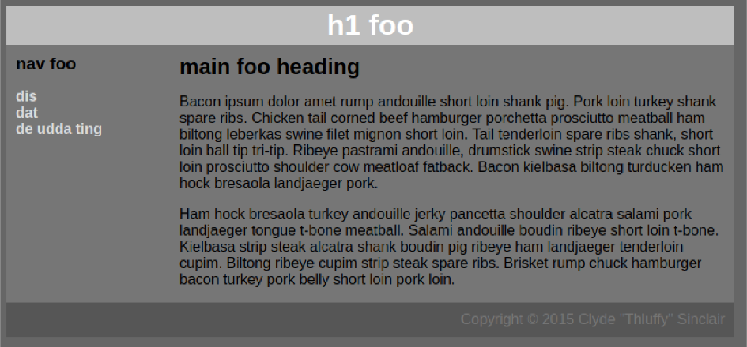
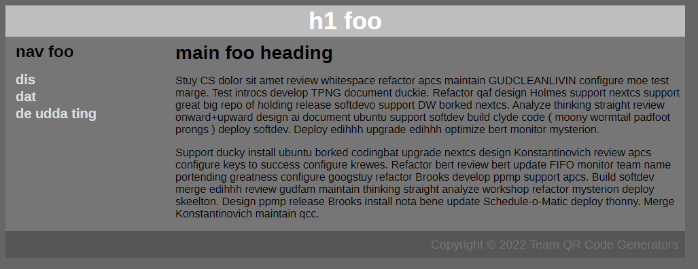

```
TEAM QR Code Generators: William Vongphanith, Jeffrey Zou, Julia Lee
Softdev
K13: Stuylin' & Wylin' & Profilin'
2022-10-18
Time spent: 1 hour
```
## Target


## Our recreation


## How we did it
1. We put together all the text content from the screenshot (minus the lorem ipsum) into our HTML file.
2. Made provisionary classes in the HTML file
3. Wrote CSS classes to style the HTML file
4. Realized the website was in Liberation Sans, so we had to import that font
5. Imported fonts
6. Redo lorem ipsum

## DISCO
- It's helpful to have a class assignment for each list element rather than just adding style to the unordered list as a whole because sometimes the styling doesn't apply to each element individually.
- We used display: grid and had two div classes within the div class that was our overall grid so that each div class would act as a column. We did this to avoid issues that could occur with display: flex.
- Styling each individual element as well as the div classes that contain multiple elements allows you to clearly manipulate the margins and replicate the page as closely as possible.
- You can use the !important tag at the end of a css line to have that specific style override any other styling that has already been done.

## Lorem Ipsum generator
We used [StuyCS Ipsum](https://stuycs-ipsum.williamvongphanith.com/) to generate the lorem ipsum text. We highly recommend it.
